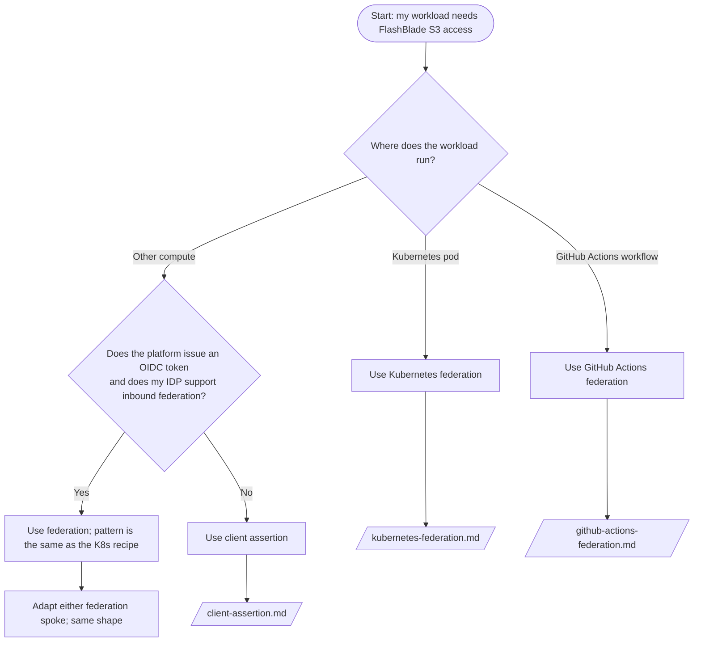
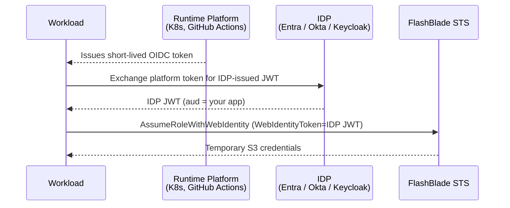

# STS Application Integration

How to integrate modern applications with FlashBlade STS without storing long-lived secrets, focused on workload identity federation (recommended) with private-key JWT (client assertion) as a fallback for environments that cannot federate.

This guide complements [`docs/idp/`](../idp/README.md), which covers interactive validation with the `fbsts` CLI. If you have a human at a keyboard who needs to validate the trust setup, start there. If you have an unattended workload (a service running in Kubernetes, a CI/CD pipeline, a long-running daemon), this is the right place.

## Decision Tree

## The Two Patterns at a Glance

| Aspect | Workload Identity Federation | Private Key JWT (Client Assertion) |
|---|---|---|
| Secret material on the workload | None | A private key (file, KMS, or HSM) |
| Who issues the workload's JWT | The runtime platform (kubelet, GitHub Actions runner) | The workload itself, signing assertions on demand |
| Refresh model | Platform rotates token automatically; app re-reads | App signs a fresh assertion on every IDP token request |
| Where it shines | Kubernetes, GitHub Actions, any platform with a native OIDC issuer | On-prem servers, third-party SaaS, anything without a platform OIDC token |
| Where it doesn't | Platforms with no native OIDC issuer; IDPs that don't support inbound federation | Anywhere a private key would be a liability (open networks, ephemeral storage) |

## Concept Primer

### Workload identity

A *workload identity* is the identity of a piece of software (a service, a container, a CI job) — distinct from a user. Workload identities don't authenticate by typing passwords; they authenticate by presenting cryptographic proof that they are running in a specific, trusted runtime context.

### The token-exchange chain

For client assertion, replace the first leg ("platform issues OIDC token") with "app signs a JWT assertion using its private key." The remaining hops are identical.

### `aud`, `sub`, `iss` recap

In the JWT presented to FlashBlade STS:

- **`iss` (issuer)** — the IDP that minted this JWT. Must match the issuer URL configured on the FlashBlade OIDC provider.
- **`aud` (audience)** — who this JWT is for. Must match the audience configured on the FlashBlade OIDC provider. For Entra, this is your application's client ID. For Okta and Keycloak, it depends on the audience mapper.
- **`sub` (subject)** — the identity making the request. For client assertion: typically the IDP-side client ID. For federation: depends on what the IDP put there (e.g., the original platform's subject like `system:serviceaccount:default:my-app`).

Trust policy conditions on the FlashBlade role usually condition on `sub` (who) and `aud` (which app).

## Security Baseline

These apply regardless of which pattern you pick:

1. **Apply least privilege on the role.** Grant only the S3 actions and resources the workload actually needs. The fact that authentication is non-interactive doesn't change the authorization story.
2. **Never log raw tokens.** Log the issuer, the role ARN, the expiry timestamp — never the bearer token. A token in a log file is a credential leak.
3. **Pin audience on the FlashBlade OIDC provider.** Don't rely solely on issuer matching. An IDP can mint many JWTs with different audiences; the FB should accept only those with the audience your app uses.
4. **Implement expiry-aware retries.** On `ExpiredToken`, refresh and retry once. Don't loop forever — a structural authorization failure looks identical at the SDK layer.
5. **Validate the trust with `fbsts validate --token` before integrating app code.** This decouples "is the FB-side configuration right" from "is my app code right."

## Where to next

- **[Kubernetes federation](kubernetes-federation.md)** — apps running in any K8s cluster (EKS, GKE, AKS, on-prem)
- **[GitHub Actions federation](github-actions-federation.md)** — CI/CD pipelines needing ephemeral S3 access
- **[Client assertion (private key JWT)](client-assertion.md)** — fallback when federation isn't available
- **[FlashBlade-side setup](flashblade-setup.md)** — OIDC provider, role, and trust policy on the array (referenced by all spokes)
- **[Token refresh and expiry](refresh-and-expiry.md)** — how long-running apps handle credential lifecycle
