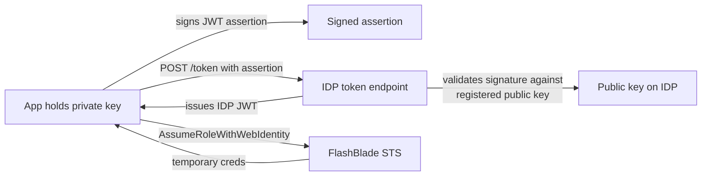
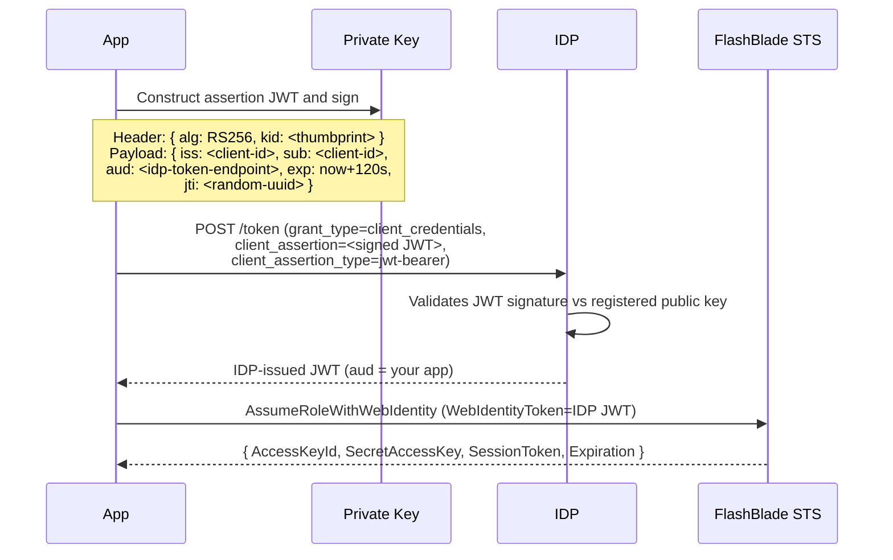

# Client Assertion (Private Key JWT)

Authenticate a workload to your IDP using a JWT it signs with its own private key. Use this when workload identity federation isn't available — typically on-prem servers, third-party SaaS, or environments without a platform OIDC token.

## When to Use This Recipe

This is the right pattern when:

- Your workload runs somewhere with no platform-issued OIDC token (a VM that isn't a managed identity, an on-prem server, a customer's data centre, an embedded device)
- Your IDP doesn't support inbound OIDC federation (rare with current Entra / Okta / Keycloak versions, but possible with older ones or specific deployments)
- Compliance requires the credential material be held by the workload, not externally managed

For everything else, federation is preferred — see the [decision tree in the README](README.md#decision-tree).

## Architecture

### System diagram



### Sequence diagram



## Prerequisites

- A solution for storing the private key. Options ranked by security:
  - **HSM or KMS** — best; the key never leaves the secure enclave. Higher operational complexity.
  - **Secret manager** (HashiCorp Vault, AWS Secrets Manager, Azure Key Vault) — good; key is centrally managed and access-audited.
  - **Filesystem with restricted permissions** — workable for low-risk environments; the workload is the only thing that can read the file.
  - **Embedded in the binary or environment variable** — not recommended.
- Ability to compute RSA-SHA256 signatures (every modern language has this).
- Network reach from the app to the IDP token endpoint.

## Step 1: Generate a key pair

On a workstation (or in your KMS, with appropriate adaptations):

```bash
# Generate the private key
openssl genrsa -out private.pem 2048

# Generate a self-signed certificate (Entra requires this; Okta and Keycloak accept either cert or bare public key)
openssl req -new -x509 -key private.pem -out public.pem -days 365 \
  -subj "/CN=fbsts-client"

# Compute the SHA-1 fingerprint — you'll use this as the JWT 'kid' header
openssl x509 -in public.pem -fingerprint -sha1 -noout
```

You'll get a fingerprint like `SHA1 Fingerprint=A1:B2:C3:...`. Strip the colons and lowercase it for the `kid` value.

Store `private.pem` according to your chosen secret-storage strategy. Never commit it to a repository.

## Step 2: Register the public key on the IDP

Pick the section matching your IDP.

### Entra ID

Navigate: **Microsoft Entra admin center → App registrations → [your app] → Certificates & secrets → Certificates → Upload certificate**.

[Screenshot: Entra admin center → App registrations → Certificates & secrets]

Required input fields:

| Field | Value | Why |
|---|---|---|
| File | `public.pem` from Step 1 | The certificate (Entra requires X.509, not just a public key) |
| Description | Any internal name (e.g., `fbsts-prod-cert-2026`) | For your reference |
| Expires | Match the cert validity period | Cert lifetime |

After upload, Entra displays a **thumbprint** for the certificate. This is the `kid` (key ID) the app must include in the JWT assertion's header. Copy it.

[Screenshot: certificate uploaded with thumbprint visible]

### Keycloak

Navigate: **Keycloak admin console → [realm] → Clients → [your client] → Credentials**.

Required input fields:

| Field | Value | Why |
|---|---|---|
| Client Authenticator | **Signed JWT** | Required for client assertion |
| Signature Algorithm | `RS256` | Matches the assertion JWT's `alg` |
| Use JWKS URL | **Off** | We're embedding the key directly |
| Public Key (paste) | Full content of `public.pem`, including `-----BEGIN CERTIFICATE-----` / `-----END CERTIFICATE-----` lines | The public half of the key |
| Key ID (kid) | Any string (e.g., `fbsts-2026-04`) | Must match the `kid` in the JWT header |

[Screenshot: Keycloak admin → Clients → [client] → Credentials]

Save. Keycloak now accepts assertion JWTs signed with the matching private key.

### Okta

Navigate: **Okta admin console → Applications → [your app] → General → Client Credentials → Public Keys → Add**.

[Screenshot: Okta admin → Applications → General → Client Credentials]

Okta accepts the public key in either JWK format or X.509. To convert:

```bash
# Convert public.pem to a base64-encoded DER form (for X.509 path):
openssl x509 -in public.pem -outform DER | openssl base64 -A
```

Required input fields:

| Field | Value | Why |
|---|---|---|
| Public Key | Pasted JWK or X.509 | The public half |
| Key ID (kid) | Auto-generated by Okta after upload — copy it | Used in the assertion JWT header |
| Client authentication method | **Public key / Private key** | Tells Okta to expect signed assertions |

[Screenshot: filled-in public key form]

Save the displayed `kid`. The app will include it in every JWT header.

## Step 3: Configure the FlashBlade

The trust on the FB side is identical to the federation patterns: the FB trusts the **IDP-issued JWT**, not the assertion. Follow [`flashblade-setup.md`](flashblade-setup.md). Note that the assertion JWT never reaches the FB — only the IDP's response JWT does.

For the trust policy: client-assertion JWTs typically have `sub = <client-id>` (no user identity). Condition the trust policy on `sub` and `aud`.

## Step 4: App code flow

On startup or scheduled refresh:

1. **Load the private key** from your secret-storage solution.

2. **Construct the assertion JWT.**

   Header (JSON, base64url-encoded):
   ```json
   {
     "alg": "RS256",
     "kid": "<thumbprint or kid from Step 2>"
   }
   ```

   Payload (JSON, base64url-encoded):
   ```json
   {
     "iss": "<your client ID>",
     "sub": "<your client ID>",
     "aud": "<IDP token endpoint URL>",
     "exp": <unix-time-now + 120>,
     "jti": "<random UUID>"
   }
   ```

3. **Sign the JWT.** Compute `header_b64.payload_b64` then RSA-SHA256-sign with the private key. Append `.signature_b64` to produce the final JWT.

4. **POST to the IDP token endpoint.**

   For Entra:
   ```
   grant_type=client_credentials
   client_id=<your client ID>
   client_assertion_type=urn:ietf:params:oauth:client-assertion-type:jwt-bearer
   client_assertion=<signed JWT from step 3>
   scope=<your client ID>/.default
   ```

   For Okta and Keycloak: same form fields except `scope` may be different (depends on your authorization server / client scope configuration).

5. **Receive the IDP-issued JWT** in the response's `access_token` field.

6. **Call FlashBlade STS** (`AssumeRoleWithWebIdentity` with `WebIdentityToken=<IDP JWT>`).

7. **Use the credentials.**

8. **Refresh:** the assertion JWT itself is throwaway — sign a fresh one (steps 1–3) on every IDP token request. The IDP-issued JWT and the FB STS credentials follow the standard refresh model — see [`refresh-and-expiry.md`](refresh-and-expiry.md).

## Validation

Once you have an IDP-issued JWT (from a manual run of steps 1–5), validate the FB-side configuration:

```bash
fbsts validate --token ./idp-jwt.txt --idp <idp> --role-arn <your-role-arn>
```

The assertion-signing portion of the app code can be unit-tested locally before integrating with the IDP.

## Troubleshooting

| Symptom | Likely cause | Fix |
|---|---|---|
| IDP rejects assertion with `invalid_client` | Wrong `kid`, wrong signing key, or `aud` doesn't match the IDP token endpoint URL exactly | Verify all three. Common mistake: using the IDP's authorization endpoint instead of token endpoint as `aud` |
| IDP rejects with `expired_token` on the assertion | Assertion `exp` is in the past (clock skew) | Keep assertion lifetime ≤2 minutes, sign with the system clock |
| IDP rejects with `invalid_grant` | Public key not registered, expired, or JWT `iss`/`sub` don't match the client ID | Re-check Step 2 was completed; verify the `iss` and `sub` are exactly the client ID |
| FB rejects with `InvalidIdentityToken: Audience mismatch` | FB OIDC provider's audience doesn't match the IDP JWT's `aud` | Run `fbsts decode ./idp-jwt.txt`; align FB config |
| Refresh storm at scale | Many replicas refresh assertions simultaneously | Jitter the refresh threshold per replica (refresh at random point between 75–85% of TTL) |
