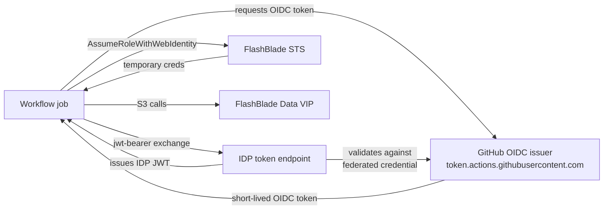
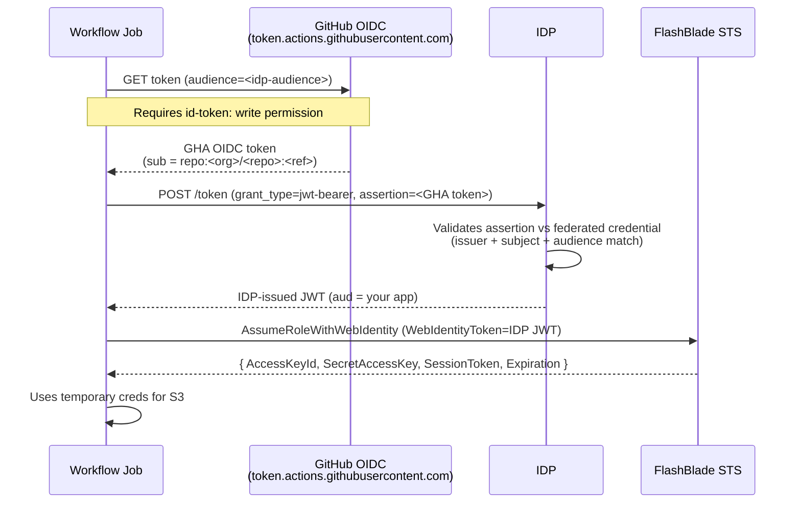

# GitHub Actions Federation

Federate a GitHub Actions workflow's OIDC token through your IDP and into FlashBlade STS, with no long-lived secrets in the workflow or repository.

## When to Use This Recipe

CI/CD pipelines running in GitHub Actions that need ephemeral FlashBlade access for testing, deployment, or build-artifact upload. Works for both public and private repositories on github.com; GitHub Enterprise Server has a different (organization-level) OIDC issuer URL but the same overall pattern.

## Architecture

### System diagram



### Sequence diagram



## Prerequisites

- Workflow has `permissions: id-token: write` configured (workflow-level or job-level).
- Workflow knows its repo, ref (branch / tag / PR / environment) — these become subject claims.
- The GitHub Actions issuer (`https://token.actions.githubusercontent.com`) is reachable from the IDP. For github.com this is public internet; for GHES, use the GHES instance's issuer URL.
- IDP admin access (Entra / Okta / Keycloak).
- `fbsts` binary on a workstation for validation.

## Step 1: Get a GitHub OIDC token in the workflow

Add `permissions: id-token: write` to your workflow. Then in a step, request the token. Two ways:

**JavaScript-based (using `@actions/core`):**

```yaml
permissions:
  id-token: write
  contents: read

jobs:
  validate:
    runs-on: ubuntu-latest
    steps:
      - uses: actions/github-script@v7
        id: get-token
        with:
          script: |
            const token = await core.getIDToken('api://AzureADTokenExchange');
            core.setOutput('token', token);
```

**Shell-based (using the runtime env vars `ACTIONS_ID_TOKEN_REQUEST_TOKEN` and `ACTIONS_ID_TOKEN_REQUEST_URL`):**

```yaml
permissions:
  id-token: write
  contents: read

jobs:
  validate:
    runs-on: ubuntu-latest
    env:
      AUDIENCE: api://AzureADTokenExchange
    steps:
      - name: Get OIDC token
        id: oidc
        run: |
          TOKEN=$(curl -sSL \
            -H "Authorization: bearer $ACTIONS_ID_TOKEN_REQUEST_TOKEN" \
            "$ACTIONS_ID_TOKEN_REQUEST_URL&audience=$AUDIENCE" | jq -r .value)
          echo "::add-mask::$TOKEN"
          echo "token=$TOKEN" >> "$GITHUB_OUTPUT"
```

The **audience** must match the audience configured on the IDP federated credential in Step 2. The Entra default is `api://AzureADTokenExchange`; Okta and Keycloak use whatever was configured.

## Step 2: Configure the federated credential on the IDP

Pick the section matching your IDP.

### Entra ID

Navigate: **Microsoft Entra admin center → App registrations → [your app] → Certificates & secrets → Federated credentials → Add credential**.

[Screenshot: Entra admin center → App registrations → Federated credentials → Add credential → GitHub Actions scenario]

Required input fields:

| Field | Value | Why |
|---|---|---|
| Federated credential scenario | **GitHub Actions deploying Azure resources** | Built-in template |
| Organization | GitHub org or username (e.g., `pure-experimental`) | The repo owner |
| Repository | Repo name (e.g., `rp-fbstsvalidator`) | The repo |
| Entity type | Branch / Pull request / Environment / Tag | Which kind of run is allowed |
| Entity value | The branch name / environment name / tag pattern | The exact value to match |
| Subject identifier (auto-built) | `repo:<org>/<repo>:ref:refs/heads/<branch>` (for Branch), `repo:<org>/<repo>:environment:<env>` (for Environment), `repo:<org>/<repo>:pull_request` (for PRs), or `repo:<org>/<repo>:ref:refs/tags/<tag>` (for Tag) | What Entra matches against the GHA JWT's `sub` |
| Audience | `api://AzureADTokenExchange` (default) | What the workflow's `core.getIDToken` audience must be |
| Name | Internal label (e.g., `gha-myrepo-main`) | For your reference |

[Screenshot: filled-in form]

Add a separate federated credential for each (org, repo, entity-type, entity-value) tuple you want to allow.

### Keycloak

Navigate: **Keycloak admin console → [realm] → Identity Providers → Add provider → OpenID Connect v1.0**.

Required input fields:

| Field | Value | Why |
|---|---|---|
| Alias | `github-actions` (or similar) | For your reference |
| Use discovery endpoint | **On** | Auto-pulls JWKS and endpoints |
| Discovery endpoint | `https://token.actions.githubusercontent.com/.well-known/openid-configuration` | GitHub's OIDC discovery URL |
| Client authentication | `client_secret_basic` (placeholder values OK) | Validation-only IdP |
| Trust email | Off | Not relevant |
| Sync mode | Default | Not relevant |

Keycloak now trusts JWTs issued by GitHub Actions. Use Keycloak's mapper / claim-to-role configuration to enforce subject restrictions (e.g., only allow `sub` matching `repo:pure-experimental/rp-fbstsvalidator:.*`).

[Screenshot: Keycloak admin → Identity Providers → Add provider]

### Okta

Navigate: **Okta admin console → Security → Identity Providers → Add → OpenID Connect IdP**.

Required input fields:

| Field | Value | Why |
|---|---|---|
| Name | `github-actions` | For your reference |
| IdP Username | `idpuser.subject` | Keys off the GHA token's `sub` claim |
| Client ID | Placeholder (e.g., `placeholder-client-id`) | Required by UI; unused |
| Client Secret | Placeholder | Same |
| Issuer URL | `https://token.actions.githubusercontent.com` | Note: no trailing slash |
| Authorization endpoint | Auto-discovered | From discovery doc |
| Token endpoint | Auto-discovered | Same |
| JWKS endpoint | Auto-discovered | Same |
| Profile master | Off | Not relevant |

[Screenshot: Okta admin → Identity Providers → filled-in form]

After save, Okta validates JWTs signed by GitHub Actions. Configure routing rules to restrict which subjects (repos / branches) are allowed.

## Step 3: Configure the FlashBlade

Same as the [Kubernetes federation recipe](kubernetes-federation.md#step-3-configure-the-flashblade) — register the IDP from Step 2 as the OIDC provider on the array.

Follow [`flashblade-setup.md`](flashblade-setup.md) for the full walkthrough.

## Step 4: Workflow code flow

After Step 1 produces the GHA OIDC token, the workflow continues:

1. **Exchange the GHA token at the IDP token endpoint.** POST to the IDP's token endpoint:

   ```
   grant_type=urn:ietf:params:oauth:grant-type:jwt-bearer
   client_id=<idp-app-id>
   assertion=<GHA token from Step 1>
   ```

   For Entra also include `requested_token_use=on_behalf_of`. Receive an IDP-issued JWT.

2. **Call FlashBlade STS** with `AssumeRoleWithWebIdentity` (form fields as in the K8s recipe Step 4).

3. **Use the credentials** for the workflow's S3 calls.

4. **Refresh:** usually unnecessary in CI because most workflows complete inside the FB STS credential TTL (default 1 hour). For long-running workflows, repeat steps 1 (request a fresh GHA token) through 3 — see [`refresh-and-expiry.md`](refresh-and-expiry.md).

## Validation

Capture an IDP-issued JWT from a test workflow run (write it to a workflow artifact temporarily, validate, then revoke):

```bash
fbsts validate --token ./idp-jwt.txt --idp <idp> --role-arn <your-role-arn>
```

A successful local validation confirms the FB-side trust is correct.

## Troubleshooting

| Symptom | Likely cause | Fix |
|---|---|---|
| `core.getIDToken` returns null or 403 | `id-token: write` permission missing | Add `permissions: id-token: write` at workflow or job level |
| GHA token audience mismatch at IDP | Workflow's audience parameter doesn't match the IDP's federated credential audience | Verify both sides use the same string — Entra default is `api://AzureADTokenExchange` |
| IDP returns `subject_does_not_match` | The federated credential's entity (branch/environment/tag) doesn't match the run | Check for typos, case sensitivity, or running on a branch / PR not in the allow list |
| FB `InvalidIdentityToken: Audience mismatch` | FB OIDC provider's audience doesn't match the IDP JWT's `aud` | Run `fbsts decode ./idp-jwt.txt` to see the actual `aud`; update FB config |
| Workflow exceeds STS TTL mid-run | Long-running job; STS credentials expired | Implement refresh as in Step 4 |
