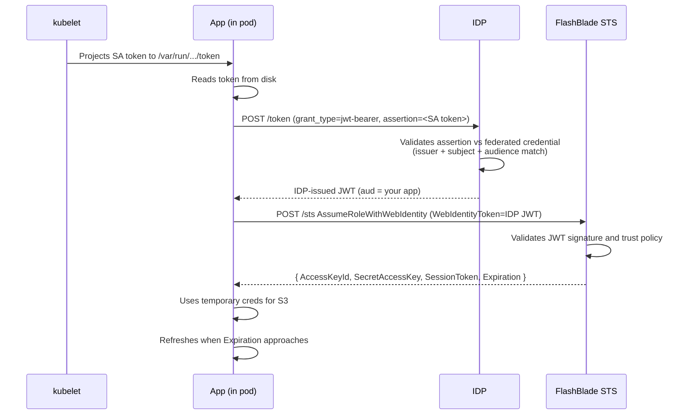

# Kubernetes Federation

Federate a Kubernetes pod's projected ServiceAccount token through your IDP and into FlashBlade STS, with no long-lived secrets on the pod.

## When to Use This Recipe

Apps running in any Kubernetes cluster (EKS, GKE, AKS, kubeadm-managed, OpenShift) where:

- The pod has a ServiceAccount with `automountServiceAccountToken: true` (default), or a `projected` volume mounting a token at a known path
- The cluster's OIDC issuer URL is reachable from your IDP (over the internet or via private peering)
- You have admin access to the IDP (Entra / Okta / Keycloak) to register a federated credential

This is the IRSA pattern (IAM Roles for Service Accounts) reshaped for FlashBlade. If you already use IRSA for AWS, this will feel familiar.

## Architecture

### System diagram

```mermaid
flowchart LR
    Pod[Pod with SA token] -->|reads| File[/var/run/secrets/.../token]
    Pod -->|jwt-bearer exchange| IDP[IDP token endpoint]
    IDP -->|validates against<br>federated credential| Issuer[Cluster OIDC issuer]
    IDP -->|issues IDP JWT| Pod
    Pod -->|AssumeRoleWithWebIdentity| FB[FlashBlade STS]
    FB -->|temporary creds| Pod
    Pod -->|S3 calls with creds| FBData[FlashBlade Data VIP]
```

### Sequence diagram



## Prerequisites

- Cluster's OIDC issuer URL is published and reachable from the IDP. Managed K8s (EKS, GKE, AKS) configures this by default. Self-hosted requires `--service-account-issuer` and `--service-account-jwks-uri` on `kube-apiserver`.
- ServiceAccount in the namespace where the pod will run.
- Pod spec with `automountServiceAccountToken: true` (default) or a dedicated projected volume.
- IDP admin access (Entra / Okta / Keycloak).
- FlashBlade reachable from the pod network.
- `fbsts` binary on a workstation for trust-policy generation against a captured token.

## Step 1: Get the cluster's OIDC issuer URL

Run from a workstation with `kubectl` configured for the target cluster:

```bash
kubectl get --raw /.well-known/openid-configuration | jq .issuer
```

Expected output is a URL. Per platform:

- **EKS:** `https://oidc.eks.<region>.amazonaws.com/id/<cluster-id>`. Also visible in the EKS cluster's "OpenID Connect provider URL" field in the AWS console.
- **GKE:** `https://container.googleapis.com/v1/projects/<project>/locations/<location>/clusters/<cluster>`. Also under "Cluster details" in the GCP console.
- **AKS:** `https://<region>.oic.prod-aks.azure.com/<tenant-id>/<cluster-id>/`. Visible under cluster's OIDC settings.
- **kubeadm / self-hosted:** whatever was configured via `--service-account-issuer`. If the issuer was not deliberately set, this step will fail; configure it before proceeding.

Save this URL. It goes into Step 2.

## Step 2: Configure the federated credential on the IDP

Pick the section matching your IDP. Each is fully self-contained.

### Entra ID

Navigate: **Microsoft Entra admin center → App registrations → [your app] → Certificates & secrets → Federated credentials → Add credential**.

[Screenshot: Entra admin center → App registrations → [your app] → Federated credentials → Add credential]

Required input fields:

| Field | Value | Why |
|---|---|---|
| Federated credential scenario | **Kubernetes accessing Azure resources** | Built-in template for K8s federation |
| Cluster issuer URL | The URL from Step 1 | Entra validates JWTs signed by this issuer |
| Namespace | The K8s namespace where the pod runs | Used to construct the subject identifier |
| Service account | The K8s ServiceAccount name | Used to construct the subject identifier |
| Subject identifier (auto-built) | `system:serviceaccount:<namespace>:<sa-name>` | What Entra matches against the JWT's `sub` claim |
| Audience | `api://AzureADTokenExchange` (default) | What the K8s SA token must request as audience |
| Name | Any internal label (e.g., `prod-cluster-default-myapp`) | For your reference |

[Screenshot: filled-in federated credential form before save]

After save, Entra accepts JWTs signed by the cluster's issuer with `sub = system:serviceaccount:<ns>:<sa>` and exchanges them for Entra-issued tokens whose `aud` is your application's client ID.

### Keycloak

Navigate: **Keycloak admin console → [realm] → Identity Providers → Add provider → OpenID Connect v1.0**.

[Screenshot: Keycloak admin → [realm] → Identity Providers → Add provider]

Required input fields:

| Field | Value | Why |
|---|---|---|
| Alias | Internal name (e.g., `k8s-cluster-prod`) | Identifier used internally by Keycloak |
| Use discovery endpoint | **On** | Auto-pulls JWKS and endpoints |
| Discovery endpoint | `<cluster-issuer>/.well-known/openid-configuration` | Cluster's OIDC discovery URL |
| Client authentication | `client_secret_basic` (placeholder values OK) | This IdP exists for token validation, not user login |
| Trust email | Off | Not relevant for workload identity |
| Sync mode | Default | Not relevant for workload identity |
| Default scopes | (leave blank) | No scopes are requested from this IdP directly |

[Screenshot: filled-in OIDC discovery form]

After save, Keycloak trusts JWTs issued by the cluster's OIDC issuer and can broker them through to its own token issuance.

### Okta

Navigate: **Okta admin console → Security → Identity Providers → Add → OpenID Connect IdP**.

[Screenshot: Okta admin → Security → Identity Providers → Add → OpenID Connect IdP]

Required input fields:

| Field | Value | Why |
|---|---|---|
| Name | `k8s-cluster-prod` (or similar) | For your reference |
| IdP Username | `idpuser.subject` | Keys off the K8s SA token's `sub` claim |
| Client ID | Placeholder (e.g., `placeholder-client-id`) | Required by Okta UI but unused for validation-only IdP |
| Client Secret | Placeholder (e.g., `placeholder-secret`) | Same |
| Issuer URL | The URL from Step 1 | What Okta validates the JWT signature against |
| Authorization endpoint | Auto-discovered | Pulled from `<issuer>/.well-known/openid-configuration` |
| Token endpoint | Auto-discovered | Same |
| JWKS endpoint | Auto-discovered | Same |
| Profile master | Off | Not relevant for workload identity |

[Screenshot: filled-in form]

After save, Okta validates JWTs signed by the cluster's issuer and can chain them into Okta-issued tokens.

## Step 3: Configure the FlashBlade

The OIDC provider you register on the array is the **IDP from Step 2 (Entra / Keycloak / Okta), not the K8s cluster directly.** The FlashBlade does not trust the cluster — it trusts the IDP that already validated the cluster's token.

Follow [`flashblade-setup.md`](flashblade-setup.md) for the array-side configuration. When prompted for issuer URL and audience, use:

- **Issuer URL:** the IDP's tenant-specific URL (e.g., `https://login.microsoftonline.com/<tenant-id>/v2.0` for Entra, `https://<keycloak-host>/realms/<realm>` for Keycloak, `https://<tenant>.okta.com/oauth2/default` for Okta)
- **Audience:** the application's client ID for Entra; for Okta and Keycloak depends on configured audience mapper

## Step 4: App code flow

Your application performs the following on startup and on credential refresh:

1. **Read the SA token from disk:** open `/var/run/secrets/kubernetes.io/serviceaccount/token` and read its full contents. Re-read on every refresh — kubelet will have updated it.
2. **Exchange at the IDP token endpoint.** POST to the IDP's token endpoint with form fields:

   ```
   grant_type=urn:ietf:params:oauth:grant-type:jwt-bearer
   client_id=<idp-app-id>
   assertion=<SA token from step 1>
   ```

   For Entra, also include `requested_token_use=on_behalf_of`. Receive an IDP-issued JWT in the response's `access_token` field.

3. **Call FlashBlade STS.** POST to the FlashBlade STS endpoint with form fields:

   ```
   Action=AssumeRoleWithWebIdentity
   Version=2011-06-15
   RoleArn=<your role ARN>
   RoleSessionName=<any session name>
   WebIdentityToken=<IDP JWT from step 2>
   ```

   Receive XML containing `AccessKeyId`, `SecretAccessKey`, `SessionToken`, and `Expiration`.

4. **Use the credentials.** Configure your S3 client (boto3, AWS SDK for Go, etc.) with the three credential fields. Direct the client at the FlashBlade Data VIP.

5. **Refresh.** When `now + safety_margin >= Expiration`, repeat steps 1–3. See [`refresh-and-expiry.md`](refresh-and-expiry.md) for recommended timing.

## Validation

Before integrating app code, validate the trust setup with `fbsts`:

```bash
# 1. Manually exchange a SA token for an IDP JWT (replay step 2 above using curl
#    against the IDP token endpoint). Save the IDP JWT to a file.

# 2. Validate that the IDP JWT works against FB STS:
fbsts validate --token ./idp-jwt.txt --idp <idp> --role-arn <your-role-arn>
```

A successful run confirms FB-side configuration is correct, isolating it from app-code debugging.

## Troubleshooting

| Symptom | Likely cause | Fix |
|---|---|---|
| K8s SA token rejected at IDP with "issuer not trusted" | Cluster OIDC issuer URL not configured on the IDP, or not reachable from the IDP | Verify Step 2 entered the exact issuer URL from Step 1; verify network reachability |
| IDP returns `subject_does_not_match` (Entra) or equivalent | The K8s SA path doesn't match the federated credential's subject identifier | Check namespace and ServiceAccount name. Common mistake: pod runs in a different namespace than configured |
| FB returns `InvalidIdentityToken: Audience mismatch` | The FB OIDC provider's audience doesn't include the IDP-issued JWT's `aud` | Update the FB OIDC provider config to include the JWT's audience (run `fbsts decode ./idp-jwt.txt` to see what `aud` is) |
| FB returns `ExpiredToken` mid-run | App didn't implement refresh | Implement refresh per Step 4 / [`refresh-and-expiry.md`](refresh-and-expiry.md) |
| K8s SA token rejected with "expired" | kubelet hasn't rotated yet, or app cached the file too long | Re-read the token file on every IDP exchange |
