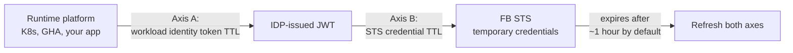

# Token Refresh and Expiry

Long-running applications need to handle credential expiry. This document explains how, scoped to the patterns in [the integration guide](README.md). Operational topics beyond refresh (caching, observability, multi-replica coordination) are deferred to a future revision; see `TODO.md`.

## The Two Refresh Axes

There are two timers that matter:



- **Axis A — workload identity token.** The K8s SA token, the GHA OIDC token, or the IDP-issued JWT after exchange. Each has its own TTL, set by the issuer.
- **Axis B — FlashBlade STS credentials.** Returned by `AssumeRoleWithWebIdentity`. TTL set by the FlashBlade per role.

Apps must refresh both, not just one.

## Workload-Identity Token TTLs by Platform

| Source | Default TTL | Refreshable? | Notes |
|---|---|---|---|
| Kubernetes projected SA token | 1 hour (default), minimum 10 minutes | Yes — kubelet rotates automatically | App must re-read `/var/run/secrets/.../token` on every IDP exchange. Don't cache the file content. |
| GitHub Actions OIDC token | Per-job; valid only for the duration of the workflow run | No — request a new one per request via `core.getIDToken` | Cannot be refreshed in the conventional sense. Each call to `core.getIDToken` returns a new token. |
| IDP-issued JWT (Entra / Okta / Keycloak) | 1 hour (default), configurable | Yes — re-do the exchange | Cache the IDP JWT in memory; don't hammer the IDP token endpoint |
| Client-assertion JWT (your app signs) | ≤2 minutes recommended | N/A — sign a fresh one on every IDP request | The assertion is single-use; the IDP-issued JWT it returns is what gets cached |

## STS Credential TTL

Set by FlashBlade, per-role, subject to a per-array maximum (typically 12 hours). Default 1 hour. Returned in the `Expiration` field of the `AssumeRoleWithWebIdentity` response.

```xml
<Expiration>2026-04-23T20:27:10.195Z</Expiration>
```

Apps should parse this as a UTC timestamp and refresh proactively (not reactively after a `401`).

## Recommended Refresh Patterns

### Long-running app

- **Refresh STS credentials at 80% of TTL.** For a 1-hour TTL, refresh at 48 minutes elapsed.
- **Refresh the IDP-issued JWT** at the same threshold by re-doing the exchange (or whenever needed if `Expiration` of STS creds outlives the IDP JWT).
- **Re-read the K8s SA token from disk on every IDP exchange.** kubelet may have rotated it.
- **Jitter the threshold** if you have multiple replicas refreshing in lockstep — refresh at a random point between 75% and 85% of TTL to avoid thundering herds.

### Short-lived job (CI workflow, batch task)

- Acquire credentials once at the start of the job.
- Don't refresh unless the job duration exceeds the credential TTL.
- For GitHub Actions specifically, most workflows complete inside the default 1-hour STS TTL — refresh is unnecessary.

### Burst traffic / many parallel callers in one process

- Acquire credentials once per process and share them via in-memory cache.
- Don't hit the IDP and STS for every request — both endpoints have rate limits, and the latency hit is significant.

## Failure Modes

| Symptom | Cause | Fix |
|---|---|---|
| `ExpiredToken` from FB STS | STS credentials expired before refresh | Reduce the refresh threshold (e.g., 70% instead of 80%); or implement reactive refresh-on-`ExpiredToken`-then-retry-once |
| `InvalidIdentityToken` from FB STS, with valid-looking IDP JWT | IDP JWT expired between issuance and the STS call (latency or clock skew) | Reduce safety margin between IDP exchange and STS call; ensure system clocks are NTP-synced |
| K8s SA token rejected at IDP with "expired" | App cached the token file content longer than kubelet's rotation | Re-read the file on every IDP exchange |
| Synchronised refresh storm across N replicas | All replicas refresh at the same elapsed-time mark | Jitter the threshold per-replica |
| Workflow `ExpiredToken` mid-run | STS TTL shorter than workflow duration | Implement refresh in the workflow (re-call `core.getIDToken`, re-exchange, re-call STS) |

## A Note on Clock Skew

JWTs include `iat` (issued at), `nbf` (not before), and `exp` (expiry) timestamps. Validators (the IDP, FlashBlade) typically allow a small skew window (e.g., 5 minutes) but reject tokens outside it.

If you see intermittent JWT-rejection errors that happen on some hosts but not others, NTP sync is the first thing to check. Run `chronyc tracking` (or equivalent) on the source host.
